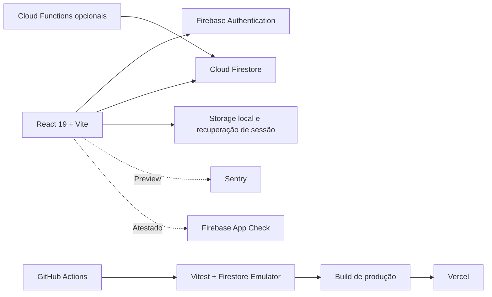

# Vitalità

> Diário inteligente de treinos com acompanhamento de evolução, experiência offline e suporte aos fluxos de aluno e personal trainer.

[](https://github.com/Tiagopbc/VitalitaApp/actions/workflows/ci.yml)
[](https://react.dev/)
[](https://firebase.google.com/)
[](https://vercel.com/)
[](#licença-e-uso)

**Aplicação:** [vitalita.vercel.app](https://vitalita.vercel.app)

**Case técnico:** [docs/portfolio-case-study.md](docs/portfolio-case-study.md)
**Arquitetura:** [docs/architecture.md](docs/architecture.md)

## Sobre o projeto

O Vitalità nasceu como um projeto de estudo e evoluiu para uma aplicação web completa de acompanhamento de treinos. O objetivo atual é demonstrar práticas de engenharia aplicadas a um produto real: arquitetura modular, segurança no Firestore, resiliência de sessão, desempenho, privacidade, observabilidade e entrega contínua.

O projeto opera sem custo recorrente obrigatório de backend. A aplicação utiliza o plano Spark do Firebase e mantém integrações opcionais, como Sentry e App Check, configuradas de forma conservadora.

## Estado atual

| Área | Situação |
| --- | --- |
| Aplicação web/PWA | Publicada na Vercel |
| Autenticação | Firebase Auth com e-mail e Google |
| Banco de dados | Cloud Firestore com regras e índices versionados |
| CI | Lint, testes, regras do Firestore, build e cobertura |
| Observabilidade | Sentry somente em ambientes Preview |
| App Check | Registrado com reCAPTCHA Enterprise, em monitoramento |
| Enforcement | Desativado por decisão consciente |
| Privacidade | Política, termos, mapa de dados e exportação JSON |

## Experiência do produto

- Criação, edição, ordenação, arquivamento e execução de fichas de treino.
- Registro de séries, carga, repetições, métodos de execução e observações.
- Timer de descanso, modo foco e salvamento contínuo durante o treino.
- Recuperação de sessão ativa após fechamento ou recarregamento do app.
- Histórico paginado, evolução de carga e filtros por rotina ou exercício.
- Metas semanais, streaks, níveis, conquistas e recordes pessoais.
- Dashboard de personal trainer com vínculos e prescrição para alunos.
- Layout responsivo para desktop, mobile e instalação como PWA.
- Exportação dos dados do usuário em JSON.

## Capturas de tela

| Login | Criação de conta | Perfil inicial |
| --- | --- | --- |
|  |  |  |

## Destaques de engenharia

### Sessão de treino resiliente

A sessão ativa é mantida localmente e sincronizada com o Firestore. O fluxo diferencia estados como salvando, salvo, offline, falha de sincronização e conflito, reduzindo o risco de perda de dados durante um treino.

### Segurança orientada à regra de negócio

As regras do Firestore validam propriedade, vínculo entre aluno e personal, campos permitidos e operações sensíveis. Os cenários de acesso são executados no Firebase Emulator Suite durante a CI.

### Performance e previsibilidade de custo

Históricos usam paginação e consultas indexadas. Estatísticas consolidadas podem ser lidas de `user_stats`, com fallback local para dados legados, evitando que o dashboard dependa de leituras completas do histórico.

### Privacidade por padrão

A observabilidade sanitiza eventos e não associa identidade do usuário. O Sentry recebe eventos somente em Preview; Production permanece sem DSN. O App Check está registrado e monitorado, mas ainda não bloqueia solicitações.

### Qualidade automatizada

O pipeline valida aplicação, regras de segurança e código opcional de Functions. Dependências são instaladas com lockfile, e o build de produção faz parte de toda revisão.

## Arquitetura



O frontend é organizado por páginas, componentes, hooks e serviços de domínio. As integrações externas são inicializadas de forma defensiva: a ausência de Sentry, App Check ou Functions não impede o funcionamento principal do aplicativo.

## Stack

| Camada | Tecnologias |
| --- | --- |
| Interface | React 19, React Router, Tailwind CSS 4, Framer Motion |
| Visualização | Recharts com carregamento sob demanda |
| Backend gerenciado | Firebase Authentication e Cloud Firestore |
| Segurança | Firestore Rules, Emulator Suite, App Check |
| Observabilidade | Sentry em Preview e Vercel Speed Insights |
| Testes | Vitest, Testing Library e Firebase Rules Unit Testing |
| Entrega | GitHub Actions e Vercel |

## Executando localmente

### Pré-requisitos

- Node.js 24 recomendado; Node.js 22 também é suportado.
- npm compatível com o lockfile do projeto.
- Java 21 para executar os testes das regras do Firestore.

### Instalação

```bash
git clone https://github.com/Tiagopbc/VitalitaApp.git
cd VitalitaApp
npm ci
cp .env.example .env.local
npm run dev
```

Preencha em `.env.local` as variáveis públicas do aplicativo Firebase. O arquivo `.env.example` também documenta as configurações opcionais de App Check, estatísticas server-side e Sentry.

> Variáveis com prefixo `VITE_` são incorporadas ao bundle do navegador. Elas não devem conter segredos privados.

## Validação

```bash
npm run lint
npm test
npm run test:rules
npm run build
```

Comandos adicionais:

```bash
npm run test:coverage
npm run test:ui
```

## Documentação

| Documento | Conteúdo |
| --- | --- |
| [Arquitetura](docs/architecture.md) | Fronteiras, fluxos e decisões técnicas |
| [Modelo do Firestore](docs/firestore-model.md) | Coleções e relacionamentos |
| [Regras de segurança](docs/security-rules.md) | Política de autorização e testes |
| [Performance](docs/performance-data.md) | Paginação, bundle e estratégia de leitura |
| [Privacidade e LGPD](docs/privacy-lgpd.md) | Mapa de dados, retenção e direitos |
| [Observabilidade](docs/observability.md) | Sanitização e política Preview-only |
| [App Check](docs/app-check.md) | Configuração monitorada e decisão de enforcement |
| [Deploy de Functions](docs/functions-deploy.md) | Procedimento opcional para estatísticas server-side |
| [Backfill de estatísticas](docs/user-stats-backfill.md) | Reconstrução administrativa de `user_stats` |
| [Testes](docs/testing.md) | Estratégia e comandos de validação |
| [Case de portfólio](docs/portfolio-case-study.md) | Problema, evolução e resultados |

## Decisões e limitações atuais

- O projeto prioriza recursos gratuitos e não depende de serviços pagos para funcionar.
- Sentry permanece restrito a Preview para validar observabilidade sem coletar dados de uso real.
- App Check permanece sem enforcement até haver volume e evidência suficientes para bloquear tráfego inválido sem afetar usuários legítimos.
- Cloud Functions e estatísticas server-side são opcionais; o cliente mantém fallback compatível com dados existentes.
- Exclusão completa e automatizada da conta ainda exige uma estratégia de limpeza confiável para documentos relacionados.

## Próximas evoluções

1. Criar testes E2E autenticados com dados previsíveis no Firebase Emulator.
2. Acompanhar métricas do App Check antes de qualquer decisão de enforcement.
3. Publicar source maps privados do Sentry nos builds de Preview.
4. Implementar exclusão completa da conta e política técnica de retenção.
5. Executar auditoria de acessibilidade e navegação por teclado.
6. Atualizar o case de portfólio com capturas autenticadas e métricas finais.

## Licença e uso

Projeto pessoal desenvolvido para estudo, evolução técnica e apresentação em portfólio. O código pode ser consultado como referência; reutilizações devem preservar os créditos do autor.

## Autor

Desenvolvido por **Tiago Cavalcanti**.

- [GitHub](https://github.com/Tiagopbc)
