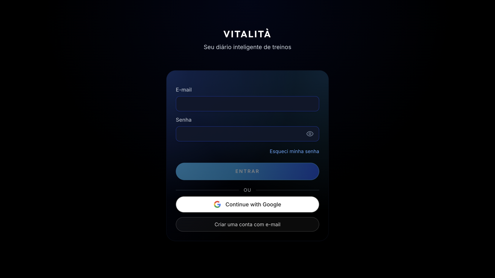
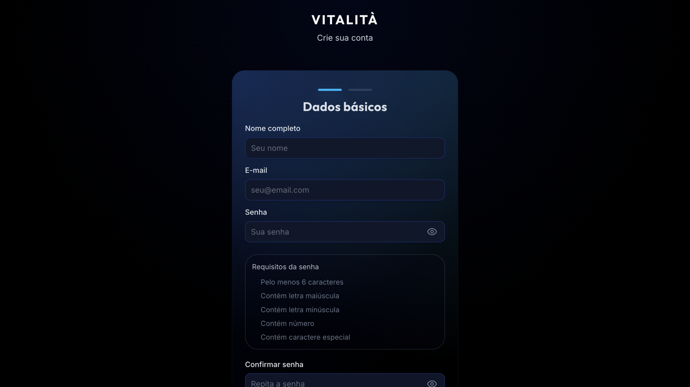
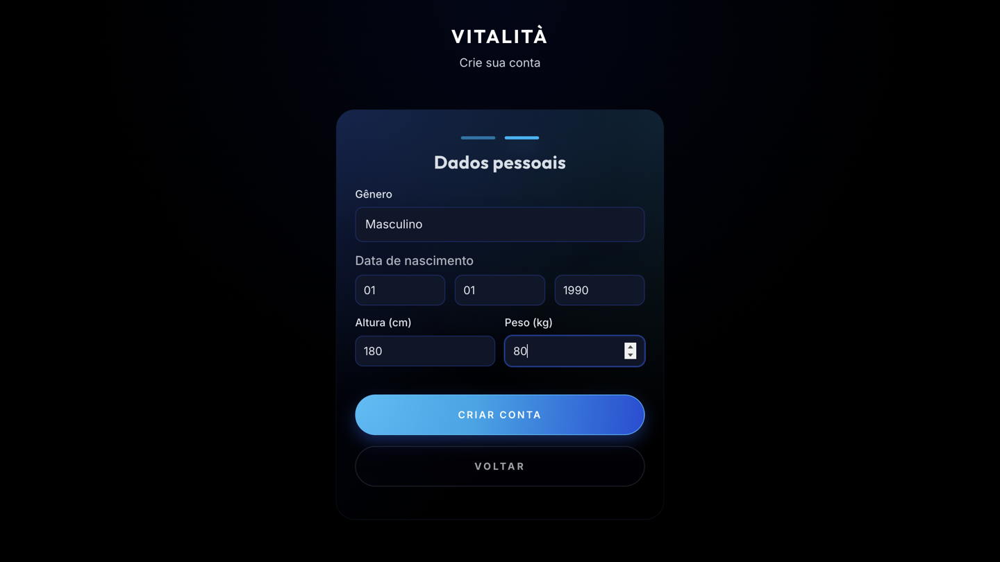
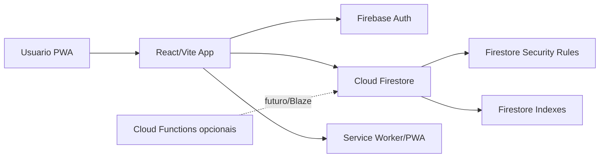

# Vitalità

<div align="center">


<br />

[](https://react.dev/)
[](https://vitejs.dev/)
[](https://firebase.google.com/)
[](https://tailwindcss.com/)
[](https://vitest.dev/)

**Diario inteligente de treinos, evolucao e performance.**

[Demo](https://vitalita.vercel.app) · [Documentacao Tecnica](docs/architecture.md) · [Case de Portfolio](docs/portfolio-case-study.md)

</div>

---

## Visao Geral

O **Vitalità** é um PWA de treino criado como projeto de estudo e portfolio de engenharia de software. A proposta é resolver uma dor simples: registrar treinos de musculacao com foco, consistencia e dados uteis, sem transformar a experiencia em uma rede social ou em um bloco de notas limitado.

O projeto combina uma experiencia mobile-first com uma base tecnica progressivamente mais profissional: autenticacao, Firestore com regras versionadas, testes automatizados, paginacao de historico, PWA, controle de sessao ativa, modo personal trainer e documentacao de arquitetura.

## Screenshots

Capturas reais da demo publicada, usando somente telas publicas e dados ficticios no onboarding. Nenhuma conta foi criada durante a captura.

| Login | Cadastro | Dados pessoais |
| --- | --- | --- |
|  |  |  |

## Objetivos de Engenharia

- Construir um produto realista, usavel e demonstravel em portfolio.
- Manter o projeto em custo zero no Firebase Spark enquanto for estudo pessoal.
- Aplicar boas praticas de seguranca e privacidade mesmo sem usuarios externos.
- Documentar caminhos profissionais de evolucao, como Cloud Functions, backfill e agregados server-side.
- Demonstrar qualidade com CI, testes, regras Firestore e decisoes tecnicas rastreaveis.

## Funcionalidades

### Aluno

- Criacao e execucao de treinos.
- Registro de carga, repeticoes, series concluidas e descanso.
- Historico paginado de sessoes.
- Dashboard com progresso semanal, streaks e sugestao de proximo treino.
- Conquistas, marcas pessoais e volume acumulado.
- PWA instalavel para uso mobile.

### Personal Trainer

- Vinculo aluno-personal por convite.
- Dashboard de alunos.
- Prescricao de treinos para alunos vinculados.
- Leitura de historico do aluno conforme regras de acesso.

### Dados e Performance

- Historico com paginacao para evitar leituras grandes no Firestore.
- Leituras recentes limitadas para dashboards e estatisticas.
- Estrutura opcional de `user_stats` documentada para evolucao server-side.
- Feature flag `VITE_ENABLE_SERVER_USER_STATS=false` para manter o modo Spark/custo zero.

## Arquitetura



### Camadas Principais

- `src/pages`: telas de produto, como dashboard, historico, perfil, treino e personal.
- `src/services`: acesso a Firebase e regras de negocio compartilhadas.
- `src/hooks`: logica de sessao de treino, sincronizacao e timer.
- `src/utils`: estatisticas, storage seguro, conquistas e helpers puros.
- `firestore.rules`: regras de seguranca versionadas.
- `tests/security`: testes automatizados das regras Firestore.
- `functions`: camada opcional de Functions/backfill para evolucao futura em Blaze.
- `docs`: documentacao tecnica do projeto.

## Decisoes Tecnicas Relevantes

### Custo Zero Com Arquitetura Profissional

O projeto roda no Firebase Spark para evitar custos. Cloud Functions e backfill existem como arquitetura opcional documentada, mas ficam desativados por padrao. O app segue funcional usando fallback de sessoes recentes.

### Segurança Firestore

As regras protegem perfis, treinos, historico, convites e vinculos aluno-personal. O cliente nao pode escrever em `user_stats`, e o acesso do personal depende de vinculo ativo.

### Performance

O historico usa paginacao e as telas de resumo trabalham com janelas recentes limitadas. Isso reduz leituras desnecessarias, melhora previsibilidade de custo e evita dashboards dependentes de historico completo.

### Robustez Da Sessao

A execucao de treino foi tratada como fluxo critico: sessao ativa, persistencia, fallback local e sincronizacao foram separados para reduzir perda de dados durante o treino.

## Qualidade

Comandos principais:

```bash
npm run lint
npm test -- --run
npm run test:rules
npm run build
npm run test:coverage
```

O CI executa:

- instalacao com `npm ci`
- lint
- testes Vitest
- testes das Functions opcionais
- Firebase Emulator para rules
- build de producao
- coverage

## Stack

- **Frontend**: React 19, Vite 7, Tailwind CSS 4
- **Backend**: Firebase Auth, Cloud Firestore
- **PWA**: Vite PWA
- **Testes**: Vitest, React Testing Library, Firebase Rules Unit Testing
- **Charts/UI**: Recharts, Lucide React, Framer Motion
- **Deploy Web**: Vercel
- **Arquitetura opcional**: Firebase Cloud Functions para agregados/backfill

## Rodando Localmente

### Pre-requisitos

- Node.js 22 recomendado.
- Projeto Firebase proprio ou variaveis de ambiente equivalentes.

### Instalação

```bash
git clone https://github.com/Tiagopbc/VitalitaApp.git
cd VitalitaApp
npm ci
```

Crie um `.env` com base em `.env.example`:

```bash
VITE_FIREBASE_API_KEY=
VITE_FIREBASE_AUTH_DOMAIN=
VITE_FIREBASE_PROJECT_ID=
VITE_FIREBASE_STORAGE_BUCKET=
VITE_FIREBASE_MESSAGING_SENDER_ID=
VITE_FIREBASE_APP_ID=
VITE_ENABLE_SERVER_USER_STATS=false
```

Inicie o app:

```bash
npm run dev
```

## Documentacao

- [Arquitetura](docs/architecture.md)
- [Modelo Firestore](docs/firestore-model.md)
- [Regras de Segurança](docs/security-rules.md)
- [Performance e Dados](docs/performance-data.md)
- [Testes](docs/testing.md)
- [Deploy de Functions opcional](docs/functions-deploy.md)
- [Backfill opcional de user_stats](docs/user-stats-backfill.md)
- [Case de Portfolio](docs/portfolio-case-study.md)
- [Rascunho para LinkedIn](docs/linkedin-post.md)

## Roadmap

- Melhorar acabamento visual das principais telas.
- Adicionar conta demo anonima para capturar dashboard, historico e execucao de treino.
- Criar fluxo guiado de demonstracao para LinkedIn e portfolio.
- Adicionar App Check em modo monitoramento, sem enforcement prematuro.
- Evoluir observabilidade leve com Sentry em ambiente controlado.
- Se o projeto sair do modo estudo, avaliar Blaze, Functions e agregados incrementais.

## Licença

Projeto desenvolvido por **Tiago Cavalcanti** para estudo, portfolio e demonstracao tecnica.
